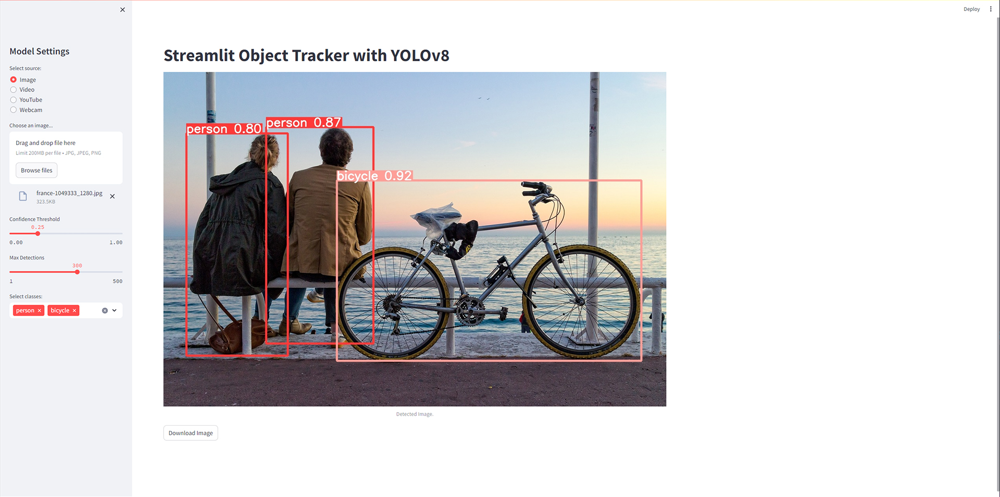
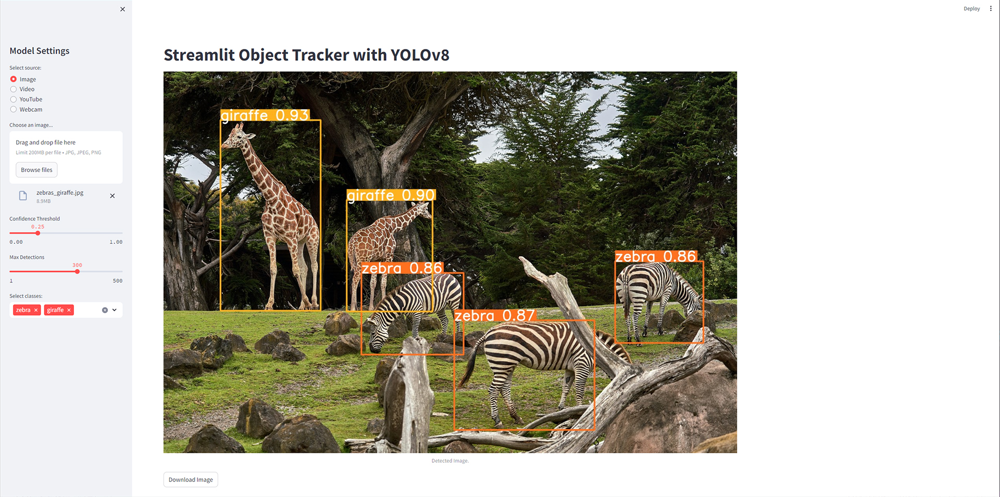

# Streamlit YOLOv8 Detector
Welcome to the Streamlit YOLOv8 Detector repository!

This repository hosts an interactive application built using Streamlit and the YOLOv8 model for real-time object detection and tracking. With this application, users can effortlessly detect and track objects in images, videos, or webcam feeds, while also having the flexibility to customize settings such as object classes and confidence thresholds.


## Application Showcase

Here are some examples of the application in action:

### Images




### Video

<https://github.com/Boohdaaaan/Streamlit-YOLOv8-Detector/assets/112556009/f69a2b22-069c-4a45-b7be-50fca3dd87e7>

## Capabilities

Discover the extensive capabilities of the Streamlit YOLOv8 Detector:

- Customize Confidence Threshold.
- Specify the maximum number of objects to detect.
- Select and focus on particular classes of objects for detection.
- Download annotated images with detected objects.

## Usage

### Requirements
* Python 3.10

### Setup
* Clone repository
```bash
  git clone https://github.com/Boohdaaaan/Streamlit-YOLOv8-Detector.git
```

* Move to project folder
```bash
  cd Streamlit-YOLOv8-Detector
```

* Install dependencies
```bash
  pip install -r requirements.txt
```

* Run project
```bash
  streamlit run app.py
```

## Acknowledgments
Special thanks to the creators of Streamlit and the YOLOv8 model for providing the tools and resources necessary to build this application.
